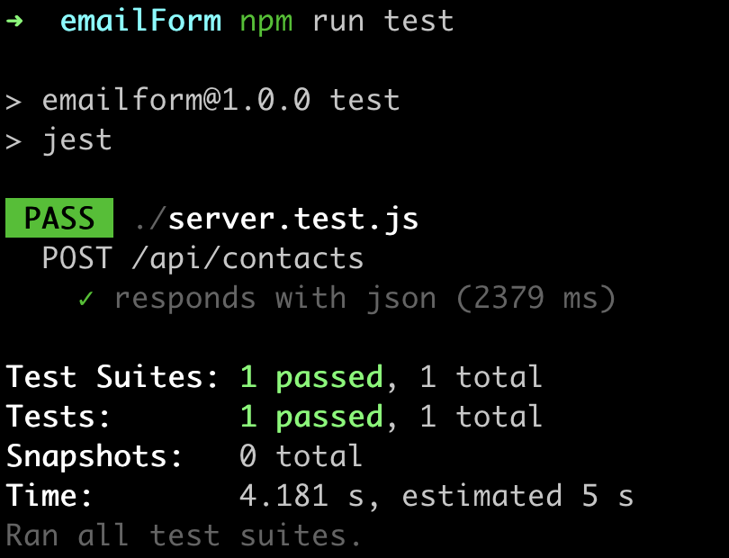

# EmailForm: Senior Full Stack Developer - Technical Assessment 

This repo is created as a submission for the Technical assessment for Senior Full Stack Developer Assessment. 

## Steps to Run 

- Ensure you have MongoDB installed and running. (Steps to install MongoDB: https://www.mongodb.com/docs/manual/installation) 
- `cd` into the project
- to start the Node server run `node index.js`
- to run the tests `npm run test`
- to run the React client `cd client && npm start`

## Email Setup 

An Ethereal Email Client has been setup to test emails. To see the incoming emails, login to:
- URL: `https://ethereal.email/`
- Username: `harvey73@ethereal.email`
- Password: `QvRye2EZcsxHZUD6nX`

## Requirements
Validations have been added on the frontend as well as the backend through Mongoose to ensure:
- First name is provided and does not exceed 25 characters.
- Last name is provided and does not exceed 25 characters.
- Email is provided and does not exceed 50 characters. Email validity is tested through Regex.
- Message is provided and does not exceed 500 characters.

## Test Result

